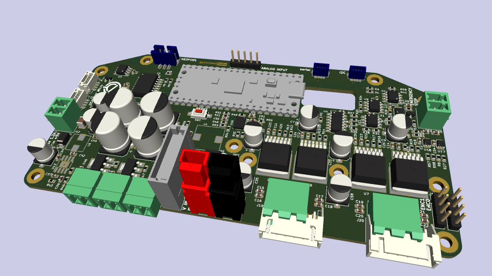
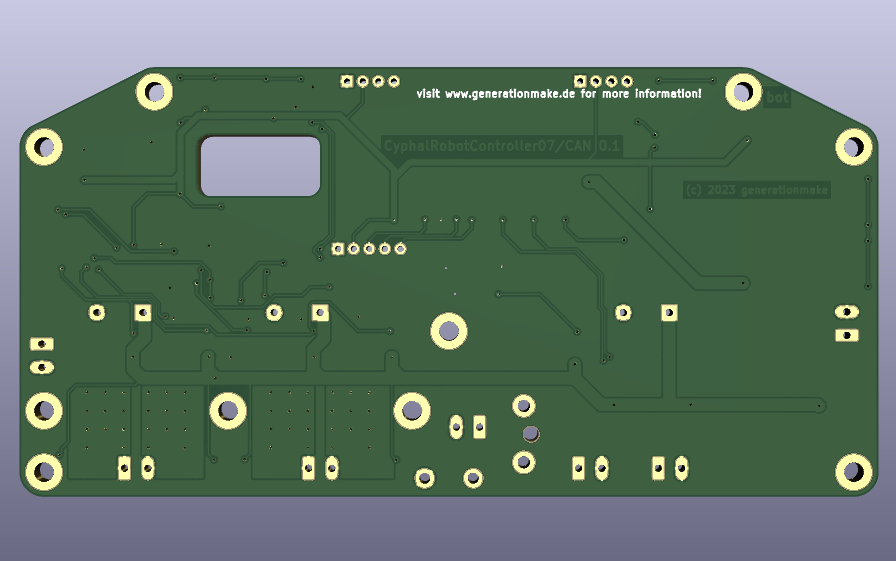

CyphalRobotController07/CAN
==================
Main controller board for the T07 robot platform and similar robots with a Raspberry Pi Pico to connect via CAN using OpenCyphal and UCANPHY Micro 

## features

- power supply for the whole system
  - 5 V for the cyphal network and embedded board (Raspberry Pi or Beagle Bone Black)
  - switchable output of battery voltage to supply additional hardware
  - switchable output of battery voltage to supply LED or head lamp
  - Input voltage up to 40 V
  - Blade type fuse (ATO fuse)
  - Power Pole connector
  - measurement of input voltage and current with TI INA232
- control 2 DC motors
  - 2 quad encoders for motors
  - emergency stop
  - Infineon IFX007T drivers, up to 40V and 55A
- ~~3 ultra sonic sensors HC-SR04~~ (not implemented yet)
- I2C bus
  - qwiic connector
  - 9 axis IMU Bosch BNO055 via I2C
  - back-EMF measurement with ADS1015
  - EEPROM 24LC64
- serial port for optional GNSS
- Neopixel for status
- CAN with Cyphal support

## Firmware
* [CyphalRobotController07-CAN-firmware](https://github.com/107-systems/CyphalRobotController07-CAN-firmware): This is the default firmware for this board. It enables all basic functions

## Pin Usage

### Raspberry Pi Pico (CN1)

| **Pin** | **Pin Name** | **Signal**    | **Direction** | **Description**                  |
|:-------:|:------------:|:-------------:|:-------------:|:--------------------------------:|
| 1       | GP0          | UART0_TX      | output        | reserved for future use (GNSS)   |
| 2       | GP1          | UART0_RX      | input         | reserved for future use (GNSS)   |
| 3       | GND          | GND           | GND           |                                  |
| 4       | GP2          | QUAD0         | input         | Quad encoder A channel 0         |
| 5       | GP3          | QUAD1         | input         | Quad encoder A channel 1         |
| 6       | GP4          | I2C0_SDA      | bidir         | for eeprom and qwiic connector   |
| 7       | GP5          | I2C0_SCL      | output        | for eeprom and qwiic connector   |
| 8       | GND          | GND           | GND           |                                  |
| 9       | GP6          | PWM4          | output        | motor pwm output 4               |
| 10      | GP7          | PWM3          | output        | motor pwm output 3               |
| 11      | GP8          | PWM2          | output        | motor pwm output 2               |
| 12      | GP9          | PWM1          | output        | motor pwm output 1               |
| 13      | GND          | GND           | GND           |                                  |
| 14      | GP10         | INH34         | output        | motor inhibit output 3 and 4     |
| 15      | GP11         | INH12         | output        | motor inhibit output 1 and 2     |
| 16      | GP12         | EM_STOP       | input         | emergency stop                   |
| 17      | GP13         | NEOPIXEL      | output        | Neopixel                         |
| 18      | GND          | GND           | GND           |                                  |
| 19      | GP14         | QUAD2         | input         | Quad encoder B channel 0         |
| 20      | GP15         | QUAD3         | input         | Quad encoder B channel 1         |
| 21      | GP16         | SPI_MISO      | input         | SPI for MCP2515                  |
| 22      | GP17         | MCP2515_CS    | output        | SPI for MCP2515                  |
| 23      | GND          | GND           | GND           |                                  |
| 24      | GP18         | SPI_CLK       | output        | SPI for MCP2515                  |
| 25      | GP19         | SPI_MOSI      | output        | SPI for MCP2515                  |
| 26      | GP20         | MCP2515_INT   | input         | interrupt for MCP2515            |
| 27      | GP21         | OUTPUT0       | output        | power output 0                   |
| 28      | GND          | GND           | GND           |                                  |
| 29      | GP22         | OUTPUT1       | output        | power output 1                   |
| 30      | RUN          | RESET         | input         | Reset for Board                  |
| 31      | GP26         | ANALOG_INPUT0 | analog input  | analog input 0                   |
| 32      | GP27         | ANALOG_INPUT1 | analog input  | analog input 1                   |
| 33      | GND          | GND           | GND           |                                  |
| 34      | GP28         | ANALOG_INPUT2 | analog input  | analog input 2                   |
| 35      | ADC_VREF     |               | analog        |                                  |
| 36      | 3V3 (OUT)    | 3V3-rail      | power         | supply voltage for board         |
| 37      | 3V3_EN       |               | input         |                                  |
| 38      | GND          | GND           | GND           |                                  |
| 39      | VSYS         |               | power         |                                  |
| 40      | VBUS         | 5V-rail       | power         | supply voltage for board         |

## I2C devices

| address | device  | description                     |
|---------|---------|---------------------------------|
| 0x40    | INA232  | voltage and current measurement |
| 0x48    | ADS1015 | motor measurement               |
| 0x4A    | BNO055  | IMU                             |
| 0x50    | 24LC64  | eeprom for storage of settings  |

## Pinout

### I2C (J1)

compatible to the Sparkfun qwiic standard (https://www.sparkfun.com/qwiic). JST SH 1mm 4-pin.

| pin number | signal        |
|:----------:|:-------------:|
| 1          | GND           |
| 2          | +3V3          |
| 3          | I2C_SDA       |
| 4          | I2C_SCL       |

### serial (J3)

JST SH 1mm 4-pin.

| pin number | signal        |
|:----------:|:-------------:|
| 1          | GND           |
| 2          | +3V3          |
| 3          | SER_TX        |
| 4          | SER_RX        |

### neopixel connector (J4)

connector for Adafruit Neopixel RGB leds (https://learn.adafruit.com/adafruit-neopixel-uberguide/the-magic-of-neopixels). JST PH 2mm 3-pin.

| pin number | signal        |
|:----------:|:-------------:|
| 1          | neopixel      |
| 2          | +5V           |
| 3          | GND           |

### CAN (J5 and J6)

UCANPHY Micro connector, according to the UCANPHY_Specification (https://forum.opencyphal.org/t/cyphal-can-physical-layer-specification-v1-0/1471). JST GH 1.25mm 4-pin.

| pin number | signal        |
|:----------:|:-------------:|
| 1          | +5V           |
| 2          | CANH          |
| 3          | CANL          |
| 4          | GND           |

### emergency stop (J7)

screw terminal 3.81 mm 2-pin.

| pin number | signal        |
|:----------:|:-------------:|
| 1          | EM_STOP       |
| 2          | GND           |

### motor output (J8 and J9)

screw terminal 3.81 mm 2-pin.

| pin number | signal        |
|:----------:|:-------------:|
| 1          | MOTOR+        |
| 2          | MOTOR-        |

### power input (J10 and J11)

screw terminal 3.81 mm 2-pin or Anderson Power Pole.

| pin number | signal        |
|:----------:|:-------------:|
| 1          | +BATT         |
| 2          | GND           |

### power output (J12)

screw terminal 3.81 mm 2-pin.

| pin number | signal        |
|:----------:|:-------------:|
| 1          | +5V           |
| 2          | GND           |

### switched power output (J13 and J14)

screw terminal 3.81 mm 2-pin.

| pin number | signal        |
|:----------:|:-------------:|
| 1          | +OUT          |
| 2          | GND           |

### quad encoder input (J15 and J16)

This is a regular 0.1-inch pin header.

| pin number | signal        |
|:----------:|:-------------:|
| 1          | GND           |
| 2          | +3V3          |
| 3          | QUAD_A        |
| 4          | QUAD_B        |

### analog input (J17)

This is a regular 0.1-inch pin header.

| pin number | signal        |
|:----------:|:-------------:|
| 1          | GND           |
| 2          | +3V3          |
| 3          | ANALOG_INPUT2 |
| 4          | ANALOG_INPUT1 |
| 5          | ANALOG_INPUT0 |

### power output (J18)

screw terminal 3.81 mm 2-pin.

| pin number | signal        |
|:----------:|:-------------:|
| 1          | +BATT         |
| 2          | GND           |

### combined motor and encoder output (J19 and J20)

This is a 0.1-inch header. It should fit to thid motor: https://precisionminidrives.com/product/37mm-gear-motor-with-encoder-%e2%88%92-50mm-type-model-nfp-jgb37-3530-en

| pin number | signal        |
|:----------:|:-------------:|
| 1          | MOTOR+        |
| 2          | MOTOR-        |
| 1          | GND           |
| 2          | +3V3          |
| 3          | QUAD_A        |
| 4          | QUAD_B        |

## PCB

### Top

### Bottom

