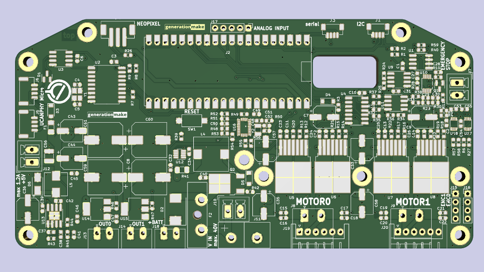

# CyphalRobotController07/CAN
Main controller board for the T07 robot platform and similar robots with a Raspberry Pi Pico to connect via CAN using OpenCyphal and UCANPHY Micro 

## features

- power supply for the whole system
  - 5 V for the cyphal network and embedded board (Raspberry Pi or Beagle Bone Black)
  - switchable output of battery voltage to supply additional hardware
  - switchable output of battery voltage to supply LED or head lamp
  - Input voltage up to 25 V
  - Blade type fuse (ATO fuse)
  - Power Pole connector
  - measurement of input voltage and current with TI INA226
- control 2 DC motors
  - 2 quad encoders for motors
  - emergency stop
  - Infineon IFX007T drivers, up to 40V and 55A
- 3 ultra sonic sensors HC-SR04
- I2C bus
  - qwiic connector
  - 9 axis IMU Bosch BNO055 via I2C
  - back-EMF measurement with ADS1015
  - EEPROM 24LC64
- serial port for optional GNSS
- Neopixel for status
- CAN with Cyphal support

## I2C devices

| address | device  | description                     |
|---------|---------|---------------------------------|
| 0x40    | INA226  | voltage and current measurement |
| 0x48    | ADS1015 | motor measurement               |
| 0x4A    | BNO055  | IMU                             |
| 0x50    | 24LC64  | eeprom for storage of settings  |
## PCB

### Top

### Bottom

